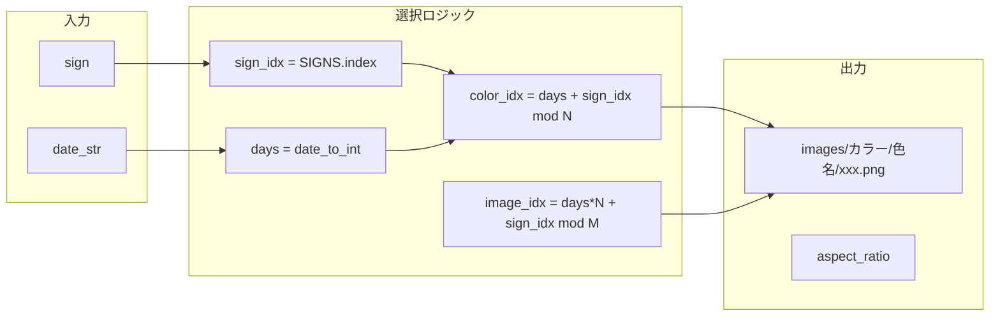

# カラーキービジュアル差し替え計画

## 現状

- **Index**: [generate.py](../../generate.py) の `write_index` がヒーローレイアウト＋キービジュアル（RANAI）を使用。**この仕様は変更しない。**
- **星座ページ**: `render_html` がシンプルレイアウト（キービジュアルなし）
- **画像ソース**: `get_key_visual_for_date(date_str)` が RANAI を日付で順次選択（index 用）

## 変更方針

1. **Index**: RANAI をそのまま使用（`get_key_visual_for_date` は現状維持）
2. **星座ページ**: `assets/images/カラー` をキービジュアルとして使用
3. 星座ページを index と同様のヒーローレイアウトに統一
4. カラー画像選択ロジックで 4 条件を満たす

## 画像選択アルゴリズム

`assets/images/カラー` は色名フォルダ（アクアマリン、イエロー、レッド等 35 色以上）で構成。各フォルダ内に PNG が複数。

| 条件 | 実装 |
|------|------|
| 同一星座が連続日で同色にならない | `color_idx = (days + sign_idx) % num_colors` で日ごとにローテーション |
| 同日に同色が重複しない | 上記で 1 日 12 星座に 12 色を割り当て（色数 >= 12） |
| 画像を満遍なく利用 | `image_idx = (days * num_colors + sign_idx) % len(images)` で色内ラウンドロビン |
| 色が最後まで利用されたらループ | 上記の `% len(images)` でループ |

## 実装ステップ

### 1. カラー画像ローダー

- `_load_color_images()`: `assets/images/カラー` を走査し、`[(色名, [png_path, ...]), ...]` を返す
- 色名でソート、PNG のみ（mp4 除外）
- 画像 1 枚以上の色のみ使用、色数 >= 12 をチェック

### 2. 新選択関数

- `get_key_visual_for_sign_and_date(sign: str, date_str: str) -> (path, aspect_ratio)`
- 上記アルゴリズムで色・画像を決定
- パスは `images/カラー/{色名}/{ファイル名}`（Web 用スラッシュ）

### 3. テンプレート共通化

- `write_index` と星座ページで同じヒーロー HTML を使う
- `_render_hero_html(data, img_src, aspect_ratio)` を新規作成
- `write_index`: **既存のまま** `get_key_visual_for_date(date_str)` で RANAI を取得
- `write_sign_files`: `get_key_visual_for_sign_and_date(sign, date_str)` でカラー画像を取得し、`_render_hero_html` でヒーローレイアウトを出力

### 4. 星座ページの HTML 統一

- 現在の `render_html` はシンプルレイアウトのため削除
- `write_sign_files` は `_render_hero_html(data, img_src, aspect_ratio)` のみを使用
- 星座ページの `data` に `sign`, `sign_ja`, `date`, `summary`, `choices`, `next_step` が含まれることを利用

### 5. 画像コピー

- 既存の `shutil.copytree(assets/images, site/images)` で `カラー` も含めてコピー済み
- 追加対応不要

## 変更ファイル

| ファイル | 変更内容 |
|----------|----------|
| [generate.py](../../generate.py) | `_load_color_images`, `get_key_visual_for_sign_and_date` 追加、`_render_hero_html` 抽出、`write_sign_files` をヒーロー＋カラーに変更。`write_index` は RANAI のまま。 |

## 補足

- 色フォルダ数は 35 以上あり、12 星座分の色割り当てに十分
- `get_key_visual_for_date` は index 用にそのまま維持（RANAI）
- テスト: 星座ページの HTML 構造が変わるため、必要に応じて `test_generated_site.py` を更新
