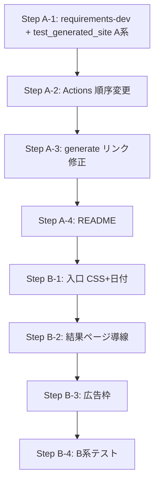

# 実装仕様_03 実装計画

## 現状との差分


| 項目      | 現状                    | 仕様_03                      |
| ------- | --------------------- | -------------------------- |
| CI 順序   | pytest → generate     | generate → pytest（生成物を検証）  |
| 生成物検証   | 内部関数呼び出し              | subprocess + BeautifulSoup |
| 入口リンク   | 相対 `./{sign}/` + base | BASE_PATH を href に明示（仕様例）  |
| 入口の日付表示 | なし                    | JST 日付を表示（B1）              |
| 入口レイアウト | ul のみ                 | グリッド（2〜3列、B1）              |
| 結果ページ導線 | 入口へ戻るのみ               | 「他の星座」リンク群（B2）             |
| 広告枠     | なし                    | プレースホルダ（B3）                |
| README  | 簡易                    | cron/JST/ローカル手順を明記（A4）     |


---

## Aフェーズ：運用（先に実装）

### Step A-1: 依存とテストファイルの追加

**1. requirements-dev.txt を新規作成**

```
pytest
beautifulsoup4
```

（`requirements.txt` は pytest のみのまま。CI で両方 install）

**2. tests/test_generated_site.py を新規作成（A系テスト 1〜6）**

- 各テストで `subprocess.run(["python", "generate.py"], env={**os.environ, "BASE_PATH": "..."})` を実行
- 生成先 `site/` が既存の場合は削除してから生成（テストの独立性）
- BeautifulSoup で `site/index.html`, `site/aries/index.html` 等を検証


| テスト                                 | 検証内容                                               |
| ----------------------------------- | -------------------------------------------------- |
| test_generate_creates_12_sign_pages | `site/{sign}/index.html` が 12 個存在                  |
| test_index_has_12_links             | 入口にリンク 12 個、href が星座に対応                            |
| test_contains_today_jst_date        | aries 等に JST の YYYY-MM-DD が含まれる                    |
| test_base_path_local_links          | BASE_PATH=/ でリンクが /aries/ 形式                       |
| test_base_path_pages_links          | BASE_PATH=/daily-zodiac/ で /daily-zodiac/aries/ 形式 |
| test_utf8_meta_and_japanese_present | meta charset utf-8 と「牡羊座」等の日本語                     |


JST 日付計算は [generate.py](generate.py) の `get_jst_date_str()` と同じロジック（`datetime.now(JST).strftime("%Y-%m-%d")`）を使用。

### Step A-2: Actions の順序変更と依存追加

[.github/workflows/pages.yml](.github/workflows/pages.yml):

- Install: `requirements.txt` に加え `requirements-dev.txt` を install
- 順序変更: **Generate site → Run tests**
- テストが落ちたら deploy しない（現状どおり）

### Step A-3: generate.py のリンク形式修正（必要なら）

仕様: 入口リンクは `BASE_PATH` を使って `href = f"{base_path}{sign}/"` 形式とする。

現状は `./{s}/` + `<base href>`. テストで「href が /aries/ または /daily-zodiac/aries/ を含む」を検証するなら、両方で動く。  
明示的に BASE_PATH を href に含める場合は、[generate.py](generate.py) の `write_index` を修正:

```python
base = BASE_PATH.rstrip("/") + "/"
links = "\n".join([f'<li><a href="{base}{s}/">...</a></li>' for s in SIGNS])
```

（`<base href>` は維持して他ページの相対リンク用に利用）

### Step A-4: README 更新

[README.md](README.md) に以下を追記:

- cron: `10 21 * * *` = UTC 21:10 = JST 06:10
- 日付基準: JST
- ローカル確認（PowerShell）:
  - `$env:BASE_PATH="/"`
  - `python .\generate.py`
  - `python -m http.server 8000 --directory .\site`
  - `http://localhost:8000/`

---

## Bフェーズ：見た目（A が緑になってから）

### Step B-1: 入口ページの CSS フックと日付

[generate.py](generate.py) の `write_index`:

- `<ul class="sign-grid">` に変更（グリッド用フック）
- 今日の日付（JST）: `<p class="today">{date_str} (JST)</p>` を追加
- 埋め込み CSS で 2〜3 列グリッド、スマホ幅で 1 列

### Step B-2: 結果ページの導線

[generate.py](generate.py) の `render_html`:

- ページ下部に「他の星座」リンク 12 個を小さめに配置
- h1/h2 構造を整理（現状ほぼ OK）

### Step B-3: 広告枠プレースホルダ

- 入口: `<div class="ad-slot" aria-label="ad-placeholder"></div>`（固定高さ）
- 結果: 同様
- CSS: `min-height: 120px` などで CLS を防止

### Step B-4: B系テストの追加

[tests/test_generated_site.py](tests/test_generated_site.py) に 7〜9 を追加:


| テスト                             | 検証内容                      |
| ------------------------------- | ------------------------- |
| test_index_has_grid_css_hook    | `class="sign-grid"` 等のフック |
| test_pages_have_ad_placeholder  | 入口・結果に `class="ad-slot"`  |
| test_result_has_other_signs_nav | 結果ページに他星座リンク群             |


---

## 実装順序サマリ




---

## ファイル変更一覧


| ファイル                         | 操作                        |
| ---------------------------- | ------------------------- |
| requirements-dev.txt         | 新規                        |
| tests/test_generated_site.py | 新規（A 系 → B 系を順次追加）        |
| .github/workflows/pages.yml  | 順序変更・依存追加                 |
| generate.py                  | リンク形式・入口日付・グリッド・広告枠・他星座導線 |
| README.md                    | cron/JST/ローカル手順を追記        |


---

## 注意点

- 既存テスト（test_templates, test_determinism, test_generate_outputs）はそのまま維持
- test_generated_site は subprocess で generate を実行するため、conftest の path 設定はそのままでよい
- Bフェーズは A がすべて緑になってから着手する

